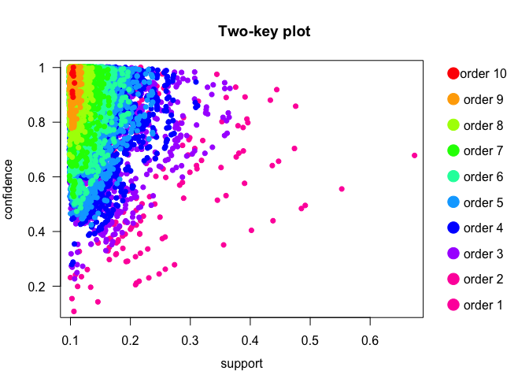
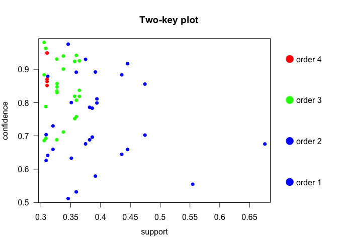

The dataset: A data set recording the disabilities of 21574 elderly
people in the United States of America was collected as part of the
National Long Term Care Survey (NLTCS). Each person’s disability in
sixteen tasks of daily living were recorded. Six of the tasks are
categorized as activities of daily living (ADLs) and ten are categorized
as instrumental activities of daily living (IADLs).

Variable with Description:    
Y1 eating    
Y2 getting in/out of bed    
Y3 getting around inside    
Y4 dressing    
Y5 bathing    
Y6 getting to the bathroom or using toilet    
Y7 doing heavy house work    
Y8 doing light house work    
Y9 doing laundry    
Y10 cooking    
Y11 grocery shopping    
Y12 getting about outside    
Y13 traveling    
Y14 managing money    
Y15 taking medicine    
Y16 telephoning    

Let us analyse the NLTCS dataset with the intention of finding the
insightful association rules. Firstly, let us load the required R
libraries and the dataset:

``` r
library(arules)
library(arulesViz)
```

``` r
dat <- read.table("http://mathsci.ucd.ie/~brendan/data/Old/nltcs.txt",header=TRUE)
head(dat)
```

    ##   Y16 Y15 Y14 Y13 Y12 Y11 Y10 Y9 Y8 Y7 Y6 Y5 Y4 Y3 Y2 Y1 COUNT
    ## 1   0   0   0   0   0   0   0  0  0  0  0  0  0  0  0  0  3853
    ## 2   0   0   0   0   0   0   0  0  0  0  0  0  0  0  0  1     4
    ## 3   0   0   0   0   0   0   0  0  0  0  0  0  0  0  1  0     9
    ## 4   0   0   0   0   0   0   0  0  0  0  0  0  0  1  0  0    19
    ## 5   0   0   0   0   0   0   0  0  0  0  0  0  0  1  0  1     1
    ## 6   0   0   0   0   0   0   0  0  0  0  0  0  0  1  1  0     8
    ##        PERCENT
    ## 1 17.859460462
    ## 2  0.018540836
    ## 3  0.041716881
    ## 4  0.088068972
    ## 5  0.004635209
    ## 6  0.037081672

In this analysis, we will be utilizing support, confidence and lift to
guide through and mine the rules. We will make use of Fréchet bounds and
apriori algorithm to calculate the support, confidence and lift. Then,
we will calculate individual probabilities of antecedents and
consequents. Let us approach the rule mining with two perspectives: in
the first one, we will keep on changing thresholds for support and
confidence and arrive at reasonable thresholds. Secondly, we will mine
rules with different number of elements in the antecedent.

We will generate the **transactions** out of our dataset.

``` r
# Count how many patterns occur in the data and call it M.
M <- nrow(dat)
# Make a vector of numbers from 1 to M.
indices <- 1:M
# Extract the count for how often each pattern happens.
counts <- dat$COUNT
# Construct a vector where the row number of each pattern
# records the number of times that the pattern arises
# in the data. The rep() command is used for this.
rowindices <- rep(indices,counts)
# Now, let’s create the matrix nltcsmat.
nltcsmat <- dat[rowindices,]
# Let’s drop the last two columns because they’re not needed
nltcsmat <- nltcsmat[,-(17:18)]
# Let’s reorder the columns, so that they give disabilities
# from 1 to 16 instead of 16 to 1.
nltcsmat <- nltcsmat[,16:1]
# Let’s coerce the data.frame into a matrix.
nltcsmat <- as.matrix(nltcsmat)
# Transcactions
nltcs <- as(nltcsmat,"transactions")
```

With initial values of support and confidence being 0.1, a priori
algorithm mined 21483 rules. To understand the number of rules with
variations in support and confidence, let us visually represent the
rules with the help of support vs. confidence two-key plot. From this
plot, it is evident that a large number of rules are in lower values of
support, with interesting rules lying in higher values of support and
confidence.

``` r
sup = 0.1
conf = 0.1

fit<-apriori(nltcs,parameter=list(support=sup, confidence=conf))
```

    ## Apriori
    ##
    ## Parameter specification:
    ##  confidence minval smax arem  aval originalSupport maxtime support minlen
    ##         0.1    0.1    1 none FALSE            TRUE       5     0.1      1
    ##  maxlen target   ext
    ##      10  rules FALSE
    ##
    ## Algorithmic control:
    ##  filter tree heap memopt load sort verbose
    ##     0.1 TRUE TRUE  FALSE TRUE    2    TRUE
    ##
    ## Absolute minimum support count: 2157
    ##
    ## set item appearances ...[0 item(s)] done [0.00s].
    ## set transactions ...[16 item(s), 21574 transaction(s)] done [0.01s].
    ## sorting and recoding items ... [16 item(s)] done [0.00s].
    ## creating transaction tree ... done [0.01s].
    ## checking subsets of size 1 2 3 4 5 6 7 8 9 10

    ## Warning in apriori(nltcs, parameter = list(support = sup, confidence =
    ## conf)): Mining stopped (maxlen reached). Only patterns up to a length of 10
    ## returned!

    ##  done [0.03s].
    ## writing ... [21483 rule(s)] done [0.00s].
    ## creating S4 object  ... done [0.01s].

``` r
fit<-sort(fit,by="support")
plot(fit, method = "two-key plot")
```



Let us increase the supprt and confidence thresholds to see if we can
find interesting rules.

``` r
conf = 0.5

fit<-apriori(nltcs,parameter=list(support=sup, confidence=conf))
```

    ## Apriori
    ##
    ## Parameter specification:
    ##  confidence minval smax arem  aval originalSupport maxtime support minlen
    ##         0.5    0.1    1 none FALSE            TRUE       5     0.1      1
    ##  maxlen target   ext
    ##      10  rules FALSE
    ##
    ## Algorithmic control:
    ##  filter tree heap memopt load sort verbose
    ##     0.1 TRUE TRUE  FALSE TRUE    2    TRUE
    ##
    ## Absolute minimum support count: 2157
    ##
    ## set item appearances ...[0 item(s)] done [0.00s].
    ## set transactions ...[16 item(s), 21574 transaction(s)] done [0.01s].
    ## sorting and recoding items ... [16 item(s)] done [0.00s].
    ## creating transaction tree ... done [0.01s].
    ## checking subsets of size 1 2 3 4 5 6 7 8 9 10

    ## Warning in apriori(nltcs, parameter = list(support = sup, confidence =
    ## conf)): Mining stopped (maxlen reached). Only patterns up to a length of 10
    ## returned!

    ##  done [0.03s].
    ## writing ... [21215 rule(s)] done [0.00s].
    ## creating S4 object  ... done [0.01s].

``` r
fit<-sort(fit,by="support")
```

Increasing the confidence threshold to 0.5 gave 21215 rules, suggesting
that large number of observations have high confidence. So, let us
increase the support threshold and have a look at the number of rules
mined, since only the most statistically evident and handful number of
rules can be interpreted.

``` r
sup = 0.4
conf = 0.5

fit<-apriori(nltcs,parameter=list(support=sup, confidence=conf))
```

    ## Apriori
    ##
    ## Parameter specification:
    ##  confidence minval smax arem  aval originalSupport maxtime support minlen
    ##         0.5    0.1    1 none FALSE            TRUE       5     0.4      1
    ##  maxlen target   ext
    ##      10  rules FALSE
    ##
    ## Algorithmic control:
    ##  filter tree heap memopt load sort verbose
    ##     0.1 TRUE TRUE  FALSE TRUE    2    TRUE
    ##
    ## Absolute minimum support count: 8629
    ##
    ## set item appearances ...[0 item(s)] done [0.00s].
    ## set transactions ...[16 item(s), 21574 transaction(s)] done [0.01s].
    ## sorting and recoding items ... [6 item(s)] done [0.00s].
    ## creating transaction tree ... done [0.01s].
    ## checking subsets of size 1 2 done [0.00s].
    ## writing ... [8 rule(s)] done [0.00s].
    ## creating S4 object  ... done [0.00s].

``` r
fit<-sort(fit,by="support")
inspect(fit)
```

    ##     lhs      rhs   support   confidence lift     count
    ## [1] {}    => {Y7}  0.6756744 0.6756744  1.000000 14577
    ## [2] {}    => {Y12} 0.5546028 0.5546028  1.000000 11965
    ## [3] {Y12} => {Y7}  0.4745064 0.8555788  1.266259 10237
    ## [4] {Y7}  => {Y12} 0.4745064 0.7022707  1.266259 10237
    ## [5] {Y11} => {Y7}  0.4453045 0.9169610  1.357105  9607
    ## [6] {Y7}  => {Y11} 0.4453045 0.6590519  1.357105  9607
    ## [7] {Y13} => {Y7}  0.4355706 0.8833427  1.307350  9397
    ## [8] {Y7}  => {Y13} 0.4355706 0.6446457  1.307350  9397

With support and confidence thresholds set at 0.4 and 0.5 respectively,
we mined 8 rules. The redundant rules are removed from the list so that
we analyse only the significant rules. Here, the tabulation shows the 8
rules mined and the corresponding quality measures. The -Inf and Nan for
Standardized Lift for rules \[7\] and \[8\] indicate that lower bounds,
upper bounds and lifts are all 1.0.

When sorted by support, the first two rules have empty antecedents
(lhs), suggesting that these patients have condition such that they only
have disability in the consequent. Let us have a look at the first rule:
14577 people in this dataset have only disability, Y7 (doing heavy house
work). This make sense, since disabled people are more likely to manage
their daily tasks, such as eating, taking medicine, telephoning pretty
well but they are not that comfortable doing heavy housework. In this
observation, the support of 0.67 suggests that the probability of none
in lhs and disability Y7 (doing heavy house work) in rhs co-occurring
together is 67%. Also, the confidence of 0.67 indicates that the
probability that disability Y7 (doing heavy house work) is observed,
given that no other disability is witnessed is 67%. Since this
observation has lift equal to 1, it signifies that antecedent and
consequent are independent of each other.

Now that we have seen an example of empty antecedent, let us examine the
antecedents with increased lengths with same support and confidence
thresholds. With lhs and rhs having 1 elements, we have 6 rules: {Y12}
=&gt; {Y7}, {Y7} =&gt; {Y12}, {Y11} =&gt; {Y7}, {Y7} =&gt; {Y11}, {Y13}
=&gt; {Y7} and {Y7} =&gt; {Y13}. The most prominent one {Y12} =&gt; {Y7}
signifies that probability of Y12 (getting about outside) and Y7 (doing
heavy house work) co-occurring together and given a person has Y7 (doing
heavy house work), it is likely that Y12 (getting about outside)
disability is seen. This is understandable since people who have
difficulty doing heavy work are likely to face difficulty getting about
outside. This rule has lift of 1.26 indicating that the degree to which
those two occurrences are dependent on one another. Also, these 6 rules
come in pairs of reversed lhs and rhs, with Y7 (doing heavy house work)
being common among all.

If we observe rules with 2 antecedents and stretch back support and
confidence to 0.3 and 0.5 respectively, we observe several interesting
rules based on confidence measure. The probability of disability Y7
(doing heavy house work), given disabilities Y9 (doing laundry) and Y11
(grocery shopping) is 0.98. Also, chance of disability in Y12 (getting
about outside), given disability in Y3 (getting around inside) and Y7
(doing heavy house work) is 93%.

Along with the individual probabilities PA and PB, we also calculated
the upper and lower bounds for the lift governed by Fréchet bounds. With
the help of these upper and lower bounds, tighter ranges of support and
confidence, standardized lift is found to ensure we do not miss any
interesting rules. In our 8 rules we mined, standardized lift is below
1.

With support threshold at 0.3 and confidence threshold at 0.5, we mined
58 rules, with redundant rules removed. We can visualize these rules
with help of arulesViz package:

``` r
sup = 0.3
conf = 0.5

fit<-apriori(nltcs,parameter=list(support=sup, confidence=conf))
```

    ## Apriori
    ##
    ## Parameter specification:
    ##  confidence minval smax arem  aval originalSupport maxtime support minlen
    ##         0.5    0.1    1 none FALSE            TRUE       5     0.3      1
    ##  maxlen target   ext
    ##      10  rules FALSE
    ##
    ## Algorithmic control:
    ##  filter tree heap memopt load sort verbose
    ##     0.1 TRUE TRUE  FALSE TRUE    2    TRUE
    ##
    ## Absolute minimum support count: 6472
    ##
    ## set item appearances ...[0 item(s)] done [0.00s].
    ## set transactions ...[16 item(s), 21574 transaction(s)] done [0.01s].
    ## sorting and recoding items ... [7 item(s)] done [0.00s].
    ## creating transaction tree ... done [0.00s].
    ## checking subsets of size 1 2 3 4 done [0.00s].
    ## writing ... [58 rule(s)] done [0.00s].
    ## creating S4 object  ... done [0.00s].

``` r
fit<-sort(fit,by="support")
plot(fit, method = "two-key plot")
```



It is evident from the Two-key plot that we have very few rules with
support greater than 0.5. Most of the rules are equally distributed with
confidence between 0.5 and 1.0.

To conclude, association rules help us to mine interesting rules from
any convoluted dataset. With proper utilization of Fréchet bounds,
quality measures such as support, confidence and lift, we were able to
understand our dataset and mine rules. This can be used for further
statistics. We got many insights some of which are summarized here: 1.
Disabled people are more likely to manage their daily tasks, such as
eating, taking medicine, telephoning pretty well but they are not that
comfortable doing heavy housework. 2. It is evident that doing heavy
housework has high individual associations with grocery shopping,
getting about outside and traveling, which indicates that if the later 3
are seen, the person is likely to face difficulty in doing heavy
housework. 3. If a person is facing issues in getting around inside and
doing heavy house work, there is 93% chance that he/she will face issues
in getting about outside.
